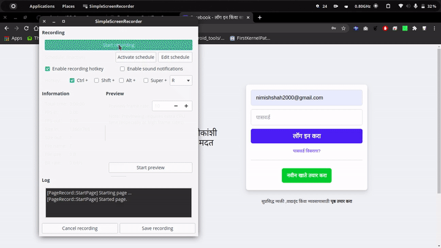

<p align="center">

  <h3 align="center">PR Pass (Pseudo Random Pass)</h3>

  <p align="center">
    An easy password generating solution.
    <br />
    <br />
  </p>
</p>

<!-- TABLE OF CONTENTS -->
<details open="open">
  <summary>Table of Contents</summary>
  <ol>
    <li>
      <a href="#about-the-project">About The Project</a>
      <ul>
        <li><a href="#built-with">Built With</a></li>
      </ul>
    </li>
    <li>
      <a href="#getting-started">Getting Started</a>
      <ul>
        <li><a href="#installation">Installation</a></li>
      </ul>
    </li>
    <li><a href="#usage">Usage</a></li>
    <li><a href="#contributing">Contributing</a></li>
    <li><a href="#license">License</a></li>
    <li><a href="#contact">Contact</a></li>
  </ol>
</details>

<!-- ABOUT THE PROJECT -->

## About The Project

This is a simple password generating solution so that you never have to remember complex passwords. Based on the inputs given by the user, A word and a Number, this tool generates passwords on-the-go which you can copy to the clipboard easily. The tool does not require any external connectivity and is pretty lightweight to use.

<a href="https://docs.google.com/document/d/1SAVaEj-phsIYZ2DSfDnd4AcV0d4VIltyI4p8KXBLc5Y/edit?usp=sharing">See Paper for more info</a>

### Built With

- JavaScript
- Python
- Dart

<!-- GETTING STARTED -->

## Getting Started

### Installation

#### Cli-Tool

You can easily install Cli tool (for linux based operating systems) with the following command.

```
sudo wget https://raw.githubusercontent.com/sudonims/PR-Pass/master/Cli-Tool/prpass -O /usr/bin/prpass; sudo chmod +x /usr/bin/prpass
```

#### Chrome Extension

- Get the latest zip from <a href="https://github.com/sudonims/PR-Pass/releases">release section</a>

- Go to [chrome://extensions](chrome://extensions) - Chrome Extensions
- Turn on developer mode from the upper right corner


- Unzip the downloaded file.
- Click on the "Load Unpacked" in extensions page on upper left corner (can be seen in step 3 image)
- Select the extracted folder.
- Turn off developer mode _(Recommended - Protects from malicious extensions)_
<!-- USAGE EXAMPLES -->

#### Android App

- Get the respective architecture apk file from <a href="https://github.com/sudonims/PR-Pass/releases">release section</a>
- Install as normal apk

#### IOS App

- You will have to compile the App yourself as Apple doesn't allow IOS App sharing without App Store.
- You will need a macOS with XCode installed
- Download flutter for macOS, clone this project and compile the app

## Usage



## Contributing

Contributions are what make the open source community such an amazing place to be learn, inspire, and create. Any contributions you make are **greatly appreciated**.

1. Fork the Project
2. Create your Feature Branch (`git checkout -b feature/AmazingFeature`)
3. Commit your Changes (`git commit -m 'Add some AmazingFeature'`)
4. Push to the Branch (`git push origin feature/AmazingFeature`)
5. Open a Pull Request

<!-- LICENSE -->

## License

Distributed under the MIT License. See `LICENSE` for more information.

<!-- CONTACT -->

## Contact

Ekansh Gupta - [Ekansh](https://github.com/rideregghost) <br />
Nimish Shah - [Nimish](https://github.com/sudonims)
